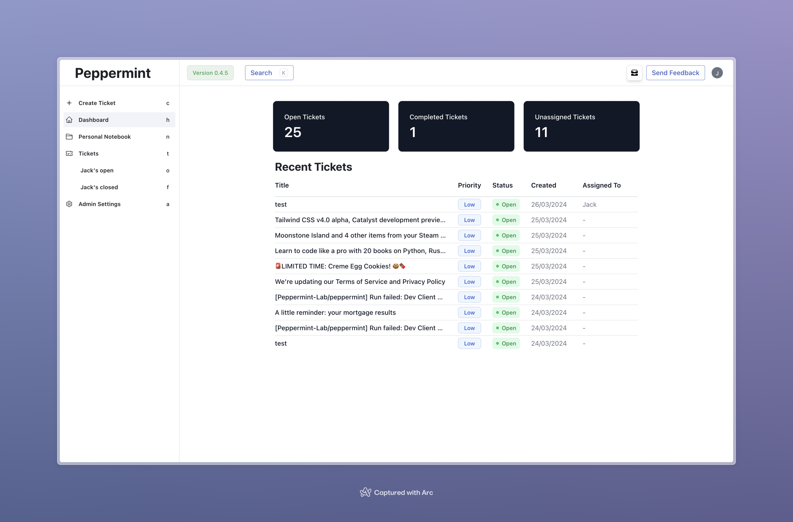

# Peppermint CI/CD pipeline

Deploy Peppermint server with CI/CD on Elestio

 
 

# Once deployed ...

You can open Peppermint UI here:

    URL: https://[CI_CD_DOMAIN]
    login: [ADMIN_EMAIL]
    password: [ADMIN_PASSWORD]

You can open pgAdmin here:

    URL: https://[CI_CD_DOMAIN]:58325
    login: [ADMIN_EMAIL]
    password: [ADMIN_PASSWORD]
